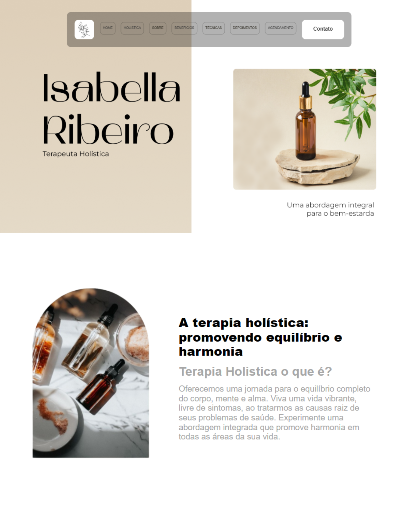

# Project title

Landing page for client.

# License

**Only inspiration**

---

# Tools used

 
 
Javascript + html + css

# Description

Landing page created for a healthcare client to showcase their work and improve engagement on google and social networks.

---

**Screen 📷**

# 

# project on Vercel.com:

https://terapeuta-isabella.vercel.app/
